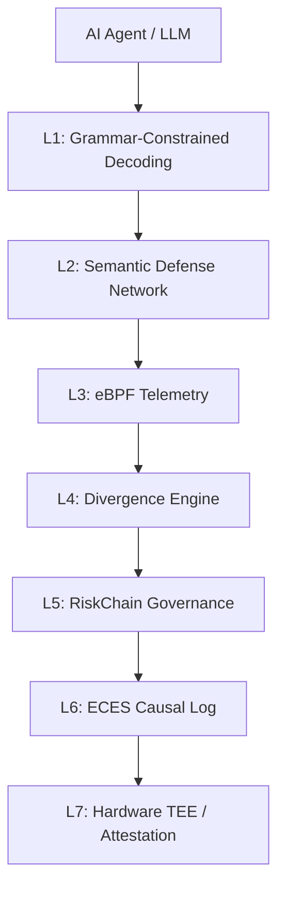

# AcademIQ Architecture (Final)

AcademIQ enforces Zero-Trust security across 7 distinct layers:

## Layer Definitions
- **L1**: Syntactic Grammar Constrained Decoding (Softmax Masking).
- **L2**: Shell Deobfuscation Normalizer + TOCTOU Resilience.
- **L3**: eBPF Kernel Call Tracing (Host-level).
- **L4**: Behavioral Divergence (Siamese / Isolation Forest).
- **L5**: Bayesian Risk + Fuzzy Governance (Freeze/Throttle).
- **L6**: ECES (Evidentiary Security) Cryptographic Hash Chains.
- **L7**: Hardware Anchored Trust (TDX/SEV-SNP/TPM + Nonce Attestation).

## L1: Grammar-Constrained Decoding (GCD)
**Goal:** Prevent dangerous LLM output structurally during text generation.
**Components:**
1. **Context-Free Grammar (CFG)**: Defines the absolute syntactic limits of tool usage.
2. **Pushdown Automaton (PDA)**: Validates each token prefix against the CFG.
3. **Logit Masking**: Masking illegal tokens to `-∞` prior to softmax.

## L2: Semantic Defense Network (SDN)
**Goal:** Prevent shell obfuscation and TOCTOU bypasses before execution.
**Components:**
1. **Shell Interceptor**: eBPF uprobe / LD_PRELOAD interceptor before `execve`.
2. **Parser**: Generates a secure, side-effect-free AST using `bashlex`.
3. **5-Pass Normalizer**: Handles variable expansion, decodes (Base64/Hex/Octal), applies ANSI-C quoting rules, resolves aliases, and strictly canonicalizes paths.
4. **Policy Matcher**: Checks canonical AST against `shell.yaml`.
5. **TOCTOU Resolver & Verifier**: Caches and verifies `inode` identities on Linux (simulated via Windows abstractions in dev).
6. **Execution Gate**: Only permits execution if L1 allowed and L2 explicitly permitted execution.

## L3: Host-Only Telemetry (eBPF)
(Planned for Phase 4) - Synthesizes system call telemetry.

## Orchestrator
Coordinates the interaction between layers, event schemas, and enforcing the security gate.
