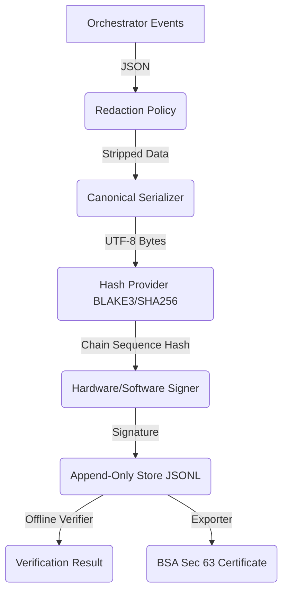

# Evidence Chain / Evidentiary Security (ECES)

The ECES layer forms the forensic integrity foundation of AcademIQ (Phase 7).

## Architecture

## Security Guarantees
1. **Determinism:** `CanonicalSerializer` strictly sorts keys, ensuring consistent UTF-8 byte representation for hashing.
2. **Causality:** The hash algorithm calculates `H_n = Hash(H_{n-1} || sequence_number || Payload_Hash)` creating a verifiable temporal order.
3. **Immutability:** Hardware/Software digital signatures prevent post-hoc tampering of the chain.
4. **Admissibility:** `CertificateGenerator` implements the technical requirements of Section 63 of Bharatiya Sakshya Adhiniyam (2023) for electronic records.

## Redaction
The `EvidenceRedactionPolicy` strips `password`, `token`, `api_key` and other sensitive values from raw event data *before* canonical hashing to ensure the forensic log doesn't become a toxic data dump, while maintaining the integrity of the structural behavior.
