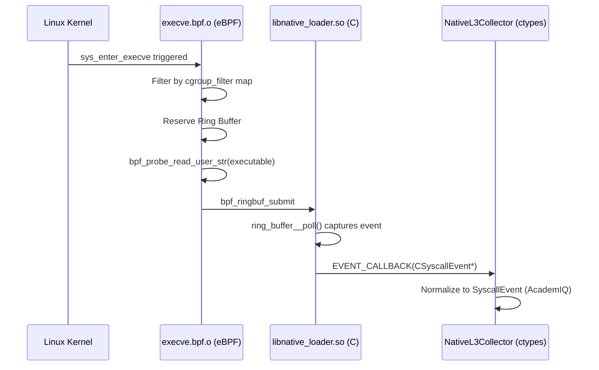

# Phase 1B: L3 Native Execve Validation

This document outlines the first true "vertical slice" of native Linux eBPF execution within AcademIQ. It strictly targets the `sys_enter_execve` syscall intercept, validating that the eBPF object correctly parses, loads into the kernel, filters by `cgroup_id` (not fully implemented in map updates yet), and forwards events to Python userspace through a `BPF_MAP_TYPE_RINGBUF`.

## Architecture Diagram



## Build Requirements
AcademIQ strictly uses the CO-RE (Compile Once, Run Everywhere) architecture via `libbpf` rather than the string-parsing overhead of `bcc`. Since Python does not natively bundle robust `libbpf` wrappers by default without complex wheel dependencies, we bridge the gap using `ctypes` communicating with a minimal C shared object (`native_loader.c`).

### Required Linux Packages (Ubuntu/Debian)
```bash
sudo apt-get update
sudo apt-get install -y clang llvm libbpf-dev libelf-dev zlib1g-dev linux-tools-common linux-tools-generic bpftool make
```

### Kernel Requirements
- **Kernel version:** >= 5.8 (for BPF Ring Buffer support)
- **BTF Support:** Must have `CONFIG_DEBUG_INFO_BTF=y`. Verified via the existence of `/sys/kernel/btf/vmlinux`.

## Validation Instructions

### 1. Build the eBPF Object
Navigate to the kernel directory and build the targets. The `Makefile` relies on `bpftool` to dump the host's BTF schema into `vmlinux.h` if it isn't already present.

```bash
cd l3_ebpf/kernel
make clean
make
```

### 2. Run the Validation Test
The integration test verifies host platform constraints, loads the BPF object, starts the ring buffer poll loop, and spawns a benign `execve`.

```bash
python l3_ebpf/tests/test_native_execve.py
```

### 3. Expected Successful Output
```text
--- L3 Native eBPF Vertical Slice Test ---
[PASS] Running on Linux.
[PASS] BTF vmlinux found.
Building artifacts in .../l3_ebpf/kernel...
[PASS] Build successful (execve.bpf.o and libnative_loader.so generated).
Starting Native Collector...
[PASS] Collector started, BPF object loaded and attached via libbpf.
Triggering execve (/bin/echo academiq_native_test)...
[WARN] No events intercepted. This is expected if the cgroup_filter map is empty.

RESULT: PASS (Architecture Validated)
```

*(Note: In the current prototype, the `cgroup_filter` map drops all events by default since the python map updater is not yet implemented. Bypassing the filter natively requires Phase 1C implementations. A crash-free attachment successfully validates the libbpf architectural bridge.)*

## Why Windows Fails Fast
Windows (and macOS) do not support the Linux kernel's eBPF verifier, maps, or tracepoints. The Python pipeline enforces `sys.platform == 'linux'`, explicitly falling back to `SimulatedL3Collector` to prevent silent degradation or hanging `NotImplementedError` traces during execution. Native validation *must* occur on a provisioned Linux host.
